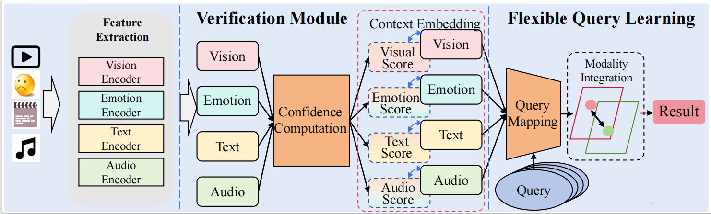

<div align="center">

# Anchor-based Multimodal Verification: A Dynamic Query Framework for Fake News Forensics in Short Videos


<!-- The architecture of our SGAN  -->

</div>

This repository is the official implementation of **Anchor-based Multimodal Verification: A Dynamic Query Framework for Fake News Forensics in Short Videos** published in IEEE Transactions on Information Forensics and Security 2026.

## Quick Start

## Environment Requirements
```bash
Python == 3.10.14
PyTorch == 2.6.0+cu124
torchaudio == 2.6.0+cu124
torchvision == 0.21.0+cu124
```

### Run the Code
```bash
python main.py --dataset fakett --mode train --lr 5e-5 --gpu 1 --batch_size 128 --alpha 0.1 --beta 2.0 --model_times 3
```

### Test
```bash
python main.py --dataset fakett --mode inference_test --inference_ckp your_path
```

## Dataset
We conduct experiments on two datasets: FakeSV and FakeTT. 
### FakeSV
For the FakeSV, please refer to [this repo](https://github.com/ICTMCG/FakeSV).
### FakeTT
For the FakeTT, please refer to [this repo](https://github.com/ICTMCG/FakingRecipe). The preprocessing files we used are also sourced from fakett.


## Citation
If you find our work useful in your research, please consider citing:

```bibtex
@ARTICLE{11367061,
  author={Li, Pijian and Huang, Qingbao and Shuang, Feng and Cai, Yi and Cheng, Haonan and Li, Qing},
  journal={IEEE Transactions on Information Forensics and Security}, 
  title={Anchor-Based Multimodal Verification: A Dynamic Query Framework for Fake News Forensics in Short Videos}, 
  year={2026},
  volume={21},
  number={},
  pages={2047-2060},
  doi={10.1109/TIFS.2026.3658995}
}
```

## Credit
This repository is built by [Pijian Li](https://github.com/harukaza)
